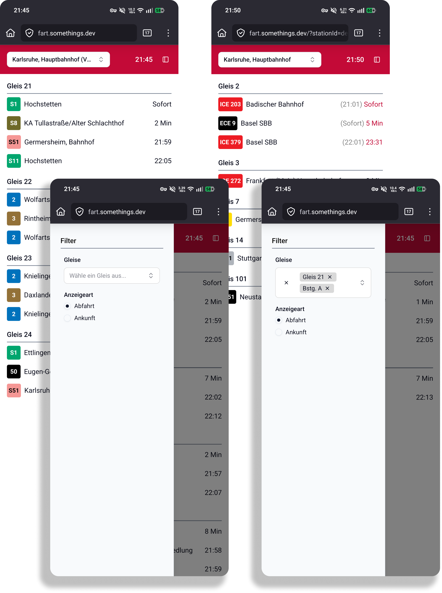

  

## 🚌 About The Project

FART is a reliable, fast, and user-friendly website for viewing real-time bus and tram departures and arrivals in the Karlsruhe area. It was created out of frustration with the existing official displays, which are often slow, unreliable, occasionally show incorrect data, or are completely absent at less-frequented stops.

This project is an independent, unofficial service built with stability and accuracy in mind. The website is actively monitored with checks running every minute to ensure maximum reliability. I strive to achieve the highest possible uptime for our users.

**Live Website:** [fart.somethings.dev](https://fart.somethings.dev)

## ✨ Features

*   **Station Search**: Find any bus or tram station within the KVV network area.
*   **Real-Time Information**: See which bus or tram is arriving next, its scheduled time, minutes until arrival, and any delays.
*   **Platform Filtering**: Filter departures or arrivals by specific platform names.
*   **View Toggle**: Choose to view either departures *from* or arrivals *to* a selected station.
*   **Reliability Focus**: The website's code and hosting infrastructure are designed for maximum uptime and speed, with continuous monitoring to ensure availability.

## 🚀 Usage

Visit [fart.somethings.dev](https://fart.somethings.dev), search for your station, and get immediate, clear departure or arrival information.

## 📊 Uptime & Reliability

I take reliability seriously. The service is monitored with checks running **every minute** from multiple locations. The uptime badge at the top of this page shows the 30-day availability history. I continuously work to maintain the highest possible uptime for our users.

## 🛠️ Technology

*   **Framework**: Built with [SvelteKit](https://kit.svelte.dev/) for a fast, reactive user experience
*   **Hosting**: Deployed and hosted at [fart.somethings.dev](https://fart.somethings.dev)
*   **Monitoring**: Uptime tracking with comprehensive monitoring infrastructure

### ⚠️ Important Legal Notice

**This is not an official offering of the Karlsruher Verkehrsverbund (KVV). The KVV is not responsible for the content or accuracy of the data presented on this site.** The project uses publicly available data but is developed and maintained independently.
